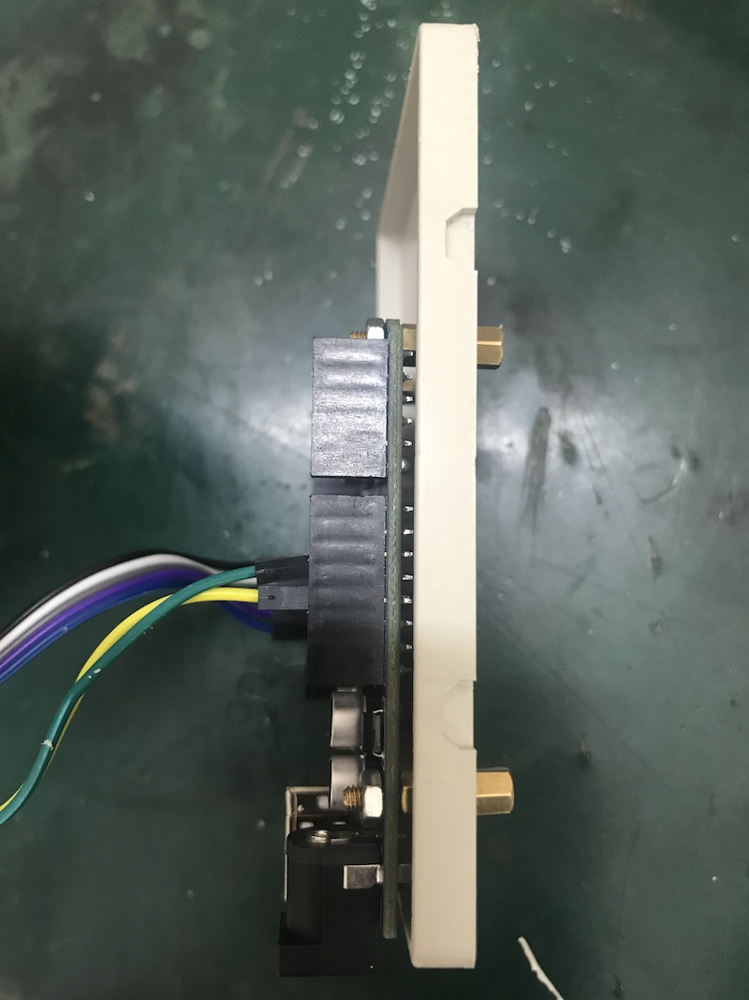

# MULTI-NFC CARD READER - generalities

Hệ thống này sẽ là công nghệ cơ sở cho một số mô hình phục vụ trưng bày.

## Vấn đề cần giải quyết

Tình huống đặt ra là người chơi cần giải quyết một câu đố liên quan đến việc chọn lựa, sắp xếp các đồ vật, và máy tính cần kiểm tra tính đúng đắn của lời giải đưa ra từ người chơi. Nếu người chơi tương tác với máy tính qua các thiết bị vào-ra chuẩn như bàn phím, con chuột, màn hình… thì việc kiểm tra lời giải thuần tuý thuộc lĩnh vực phần mềm. Tuy nhiên, do người chơi cần tương tác với các đồ vật thực, nên máy tính cần có khả năng nhận biết nhiều đồ vật một lúc một cách nhanh chóng, bao gồm cả vị trí của chúng.

## Giới hạn vấn đề

Đồ vật: có kích thước của các đồ vật thường được đặt lên bàn (bàn ăn, bàn làm việc, bàn thí nghiệm…), có đáy phẳng và tự đứng vững.

Vị trí (nếu câu đố có liên quan đến vị trí các đồ vật): các vị trí đều được xác định từ trước và có thể đặt trên đó từ 0 đến 1 đồ vật. Số lượng vị trí không quá 12.

Có hai cách để hệ thống đưa ra đánh giá, phụ thuộc vào luật chơi cụ thể:

* Bằng tay: sau khi đặt các đồ vật vào vị trí mong muốn, người chơi xác nhận lựa chọn của mình thông qua một phím bấm “Xác nhận”.
* Tự động: hệ thống sẽ đánh giá khi tất cả các vị trí đọc card được lấp đầy.

Độ trễ nhận biết: máy tính cần nhận ra vật gì được đặt vào vị trí nào trong vòng ít hơn một phần mười hai giây, để người chơi có thể nhanh chóng thực hiện động tác tiếp theo.

Môi trường xung quanh: hệ thống nhận biết đồ vật cần hoạt động trong mọi điều kiện chiếu sáng.

## Schematic design

### Main design

    +----------+    +----------+         +----------+
    |RFID—RC522|    |RFID—RC522|         |RFID—RC522|
    +-----+----+    +-----+----+         +-----+----+
          |               |                    |
         SPI             SPI       ...        SPI
          |               |                    |
      +---+---+       +---+---+            +---+---+
      |Arduino|       |Arduino|            |Arduino|
      +---+---+       +---+---+            +---+---+
          |               |                    |
          |               |                    |
          +-------------USB Hub----------------+
                             |
                             |
    +--------+        +------+-----+       +-----------------+
    |Màn hình|--------|  Computer  |-------|Các nút tương tác|
    +--------+        +------------+       +-----------------+

Using one Arduino per card reader maybe overkilled. But this system is very compact, modulable and accident/error-proof (from both human and environment).

### Alternative design #1

(for reference only)

    +----------+    +----------+         +----------+
    |RFID—RC522|    |RFID—RC522|         |RFID—RC522|
    +-----+----+    +-----+----+         +-----+----+
          |               |                    |
         SPI             SPI       ...        SPI
          |               |                    |
      +---+---+       +---+---+            +---+---+
      |Arduino|       |Arduino|            |Arduino|
      +---+---+       +---+---+            +---+---+
          |               |                    |
         I2C             I2C                  I2C
          |               |                    |
          +---------------+--+-----------------+
                             |
                     I2C level shifter
                             |
    +--------+        +------+-----+       +-----------------+
    |Màn hình|--------|Raspberry Pi|-------|Các nút tương tác|
    +--------+        +------------+       +-----------------+

The I2C level shifter is cheaper than the USB hub of the main design, but the overall cable management will be cumbersome.

### Alternative design #2

(for reference only)

    +----------+    +----------+         +----------+
    |RFID—RC522|    |RFID—RC522|         |RFID—RC522|
    +-----+----+    +-----+----+         +-----+----+
          |               |                    |
         I2C             I2C                  I2C
          |               |                    |
          +---------------+--+-----------------+
                             |
                      I2C multiplexer
                             |
    +--------+        +------+-----+       +-----------------+
    |Màn hình|--------|Raspberry Pi|-------|Các nút tương tác|
    +--------+        +------------+       +-----------------+

This is the cheapest solution, but price is its only advantage. There are many inconvenients:

* MFRC522 cards need to be tweaked (drilled) to work in I2C mode.
* Both 8 and 16-way I2C multiplexers are not available in Vietnam in this moment.
* The cable management is still cumbersome.

## Interaction diagram

Sơ đồ quy trình hoạt động sau thể hiện các hành vi của người chơi và các thiết bị kể trên:

In the above image, "Pi" can be replaced by any computer.

# Actual implementation

## Encapsulating Arduino and MFRC522

We want to encapsulate Arduino and MFRC522 cards into a solid box. The connection between the two is as followed:

       MFRC522 Reader          Arduino Uno
    Signal          Pin            Pin
    --------------------------------------
    RST/Reset       RST              9
    SPI SS          SDA(SS)         10
    SPI MOSI        MOSI            11
    SPI MISO        MISO            12
    SPI SCK         SCK             13
    power           VCC           3.3V
    ground          GND            GND            

Here are the steps to encapsulate Arduino and MRFC522 into a 10.3x6.8x3.1cm box:

*Soldering on Arduino side*

*Soldering on MFRC522 side*

*Attach Arduino to the box by "cọc đồng"*

*Finished box*

## Arduino sketch

Install the MFRC522 library with Arduino IDE. Then load the .ino sketch into the reader ("reader" here means the box Arduino+MFRC522 described earlier).

Output format: \<reader UID\>:\<card UID\>

NB. Part of the sketch, such as the reader ID, should be customized for each reader.

## Python script

There is a `requirements.txt` file to be `pip install`.

Run the `.py` script and follow the steps. The script will detect automatically serial ports to be used.

# Further improvement

Use Arduino Nano instead of Arduino Uno:

