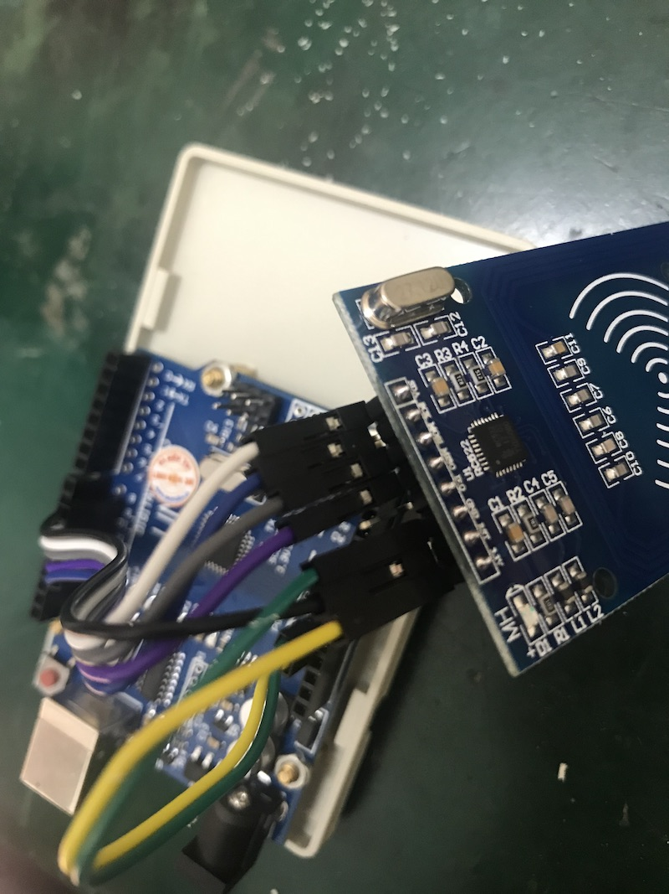
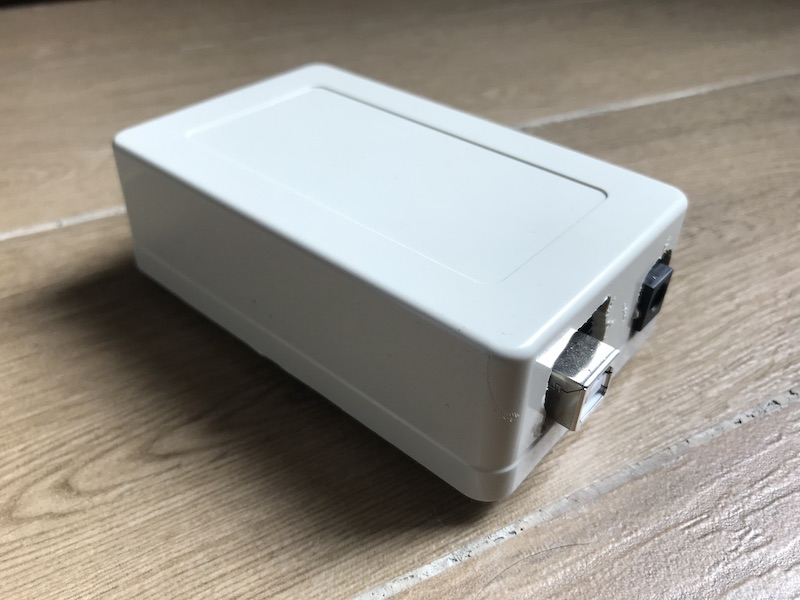

# Multiple-objects detection system

## Motivation

In today's market, most NFC detection system can only read one card at a time to say it's valid or not. We propose to create a multi-card system, which will serve as a basic platform for various applications.

A typical use case is a game of which the objective is to arrange objects in a desired order. Computer games like that are very common, but systems allowing interactions with real-world objects are not so. Such system need to recognize multiple objects at once, including their positions.

To grasp the idea, play the video below featuring [a game](https://github.com/quantranfr/SortingGame) using this detection system:

## General constraints

The following conditions must be met for any project using this detection system:

* Objects: having size of things that are normally found on a desktop (glass, card…) and having a flat base to stand on its own and to attach a NFC tag on it.
* Target positions: up to, arbitrary say, 12 fix positions.
* Detection delay: the detection must be fast enough to allow the player to take next actions. A "validation button" will slow down the process is therefore should not be allowed.
* Environment: the detection system must work in any light condition.

## Pre-requisites

### Material

To test out the system, we need to prepare:

* At least 2 NFC card reader (MFRC522);
* At least 2 Arduino (Nano, Uno, Mega…);
* USB Hub if necessary, preferably with power supply;
* 1 computer (eg. Raspberry Pi);
* and corresponding cables.

Overall wiring diagram:

    +----------+    +----------+         +----------+
    |RFID—RC522|    |RFID—RC522|         |RFID—RC522|
    +-----+----+    +-----+----+         +-----+----+
          |               |                    |
         SPI             SPI       ...        SPI
          |               |                    |
      +---+---+       +---+---+            +---+---+
      |Arduino|       |Arduino|            |Arduino|
      +---+---+       +---+---+            +---+---+
          |               |                    |
          |               |                    |
          +-------------USB Hub----------------+
                             |
                             |
    +--------+        +------+-----+       +---------+
    | Screen |--------|  Computer  |-------| Buttons |
    +--------+        +------------+       +---------+

Using one Arduino per card reader maybe overkilled. But this system is very compact and modulable enough (add/remove readers at any time). Buttons are only there to start the game.

Details of SPI connection between RC522 and Arduino Uno:

    MFRC522 Reader             Arduino
    Signal          Pin            Pin
    --------------------------------------
    RST/Reset       RST              9
    SPI SS          SDA(SS)         10
    SPI MOSI        MOSI            11
    SPI MISO        MISO            12
    SPI SCK         SCK             13
    power           VCC           3.3V
    ground          GND            GND

<figure>

<figcaption>Box breakout</figcaption>
</figure>

<figure>

<figcaption>Finished box</figcaption>
</figure>

### Code setup

* Install the MFRC522 library with Arduino IDE;
* Then load the `.ino` sketch into Arduino boards, with a **different `reader_uid`** for each board;
* Verify that on PC side you have python 3;
* Install dependencies: `pip install -r requirements.txt`.

## Run

* In one terminal, run `python webserver_mockup.py` (no need if run with [this game](https://github.com/quantranfr/SortingGame))
* In another terminal, run `python readSerial.py`

## Other designs for consideration

There may be some concerns with the Arduino Uno or Nano using CH340 chip. On some defect boards, the serial port doesn't always respond. Therefore in the future we should consider other design not using USB serial ports.

Alternative design No.1 (very cumbersome):

    +----------+    +----------+         +----------+
    |RFID—RC522|    |RFID—RC522|         |RFID—RC522|
    +-----+----+    +-----+----+         +-----+----+
          |               |                    |
         SPI             SPI       ...        SPI
          |               |                    |
      +---+---+       +---+---+            +---+---+
      |Arduino|       |Arduino|            |Arduino|
      +---+---+       +---+---+            +---+---+
          |               |                    |
         I2C             I2C                  I2C
          |               |                    |
          +---------------+--+-----------------+
                             |
                      I2C multiplexer
                             |
    +--------+        +------+-----+       +-----------------+
    | Screen |--------|     Pi     |-------| Buttons |
    +--------+        +------------+       +-----------------+

Alternative design #2 (cheap, but have to drill a hole in NFC readers to make it work in I2C mode):

    +----------+    +----------+         +----------+
    |RFID—RC522|    |RFID—RC522|         |RFID—RC522|
    +-----+----+    +-----+----+         +-----+----+
          |               |                    |
         I2C             I2C                  I2C
          |               |                    |
          +---------------+--+-----------------+
                             |
                      I2C multiplexer
                             |
    +--------+        +------+-----+       +---------+
    | Screen |--------|     Pi     |-------| Buttons |
    +--------+        +------------+       +---------+
